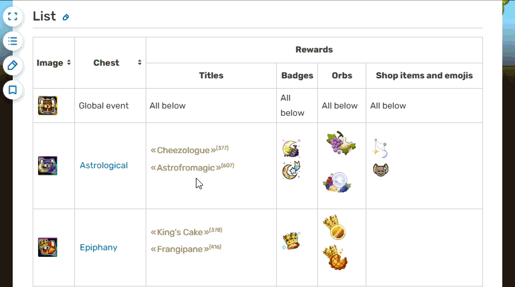

# Transformice Wiki Tracker

A small Chrome extension for tracking which Transformice badges, titles, shop items and emojis you already own from event chests.

## Installation

1. Open the extension's Chrome Web Store page: 
2. Click **Add to Chrome**.
3. Confirm by clicking **Add extension**.

Once installed, open the [Transformice Wiki page](https://transformice.fandom.com/wiki/Chest) and the tracker will be ready to use.

## Usage

Open the [Transformice Wiki page](https://transformice.fandom.com/wiki/Chest) and click a reward to mark it as owned. 
Click it again to remove the owned state.
